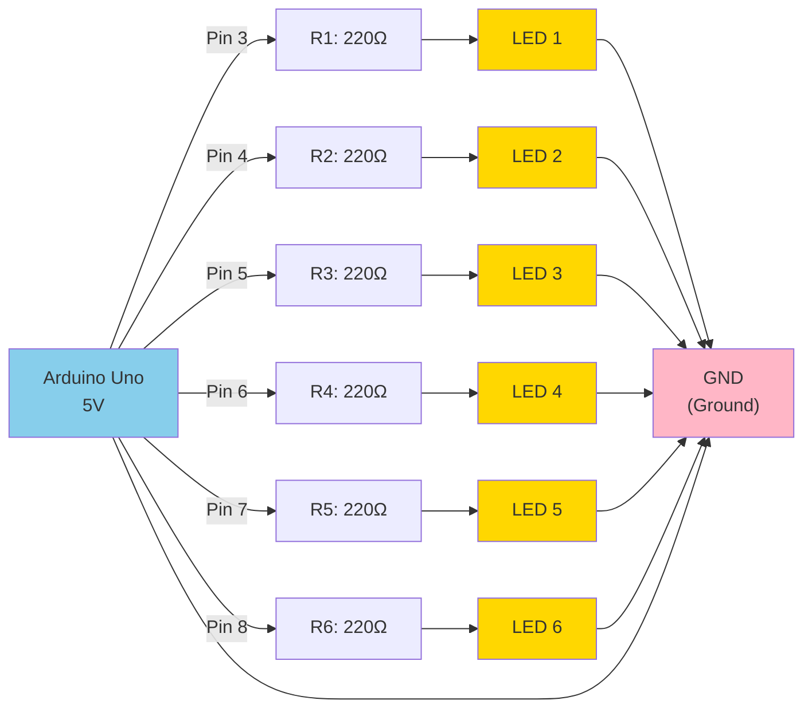

# LED Sequence Activity - Complete Summary

## Activity Objectives ✓
- ✓ Create a circuit with 6 LEDs and 220Ω resistors in series
- ✓ Light LEDs sequentially using For loop
- ✓ Provide circuit schema (Mermaid diagram)
- ✓ Document code with screenshots
- ✓ Record/demonstrate output

---

## 1. Circuit Schema (Mermaid Diagram)



---

## 2. Arduino Code

### File: `led_sequence.ino`

```cpp
// LED Sequence Circuit - 6 LEDs controlled by For Loop
// Pins: 3, 4, 5, 6, 7, 8 connected to LEDs with 220Ω resistors

const int NUM_LEDS = 6;
const int LED_PINS[NUM_LEDS] = {3, 4, 5, 6, 7, 8};
const int DELAY_TIME = 500;  // 500ms between LED changes

void setup() {
  Serial.begin(9600);

  // Initialize all LED pins as outputs
  for (int i = 0; i < NUM_LEDS; i++) {
    pinMode(LED_PINS[i], OUTPUT);
    digitalWrite(LED_PINS[i], LOW);  // Start all LEDs off
  }

  Serial.println("LED Sequence Circuit Started!");
}

void loop() {
  // Forward sequence: turn on LEDs one by one
  for (int i = 0; i < NUM_LEDS; i++) {
    digitalWrite(LED_PINS[i], HIGH);  // Turn on LED
    Serial.print("LED ");
    Serial.print(i + 1);
    Serial.println(" ON");
    delay(DELAY_TIME);
  }

  // Turn off LEDs one by one
  for (int i = 0; i < NUM_LEDS; i++) {
    digitalWrite(LED_PINS[i], LOW);   // Turn off LED
    Serial.print("LED ");
    Serial.print(i + 1);
    Serial.println(" OFF");
    delay(DELAY_TIME);
  }

  delay(1000);  // 1 second pause before repeating
}
```

### Code Highlights

**Lines 4-6: Constants Definition**
```cpp
const int NUM_LEDS = 6;                      // Number of LEDs
const int LED_PINS[NUM_LEDS] = {3,4,5,6,7,8}; // Pin numbers
const int DELAY_TIME = 500;                  // 500 milliseconds
```

**Lines 8-17: Setup Function with FOR LOOP**
```cpp
for (int i = 0; i < NUM_LEDS; i++) {     // Loop 6 times
  pinMode(LED_PINS[i], OUTPUT);           // Set pin as output
  digitalWrite(LED_PINS[i], LOW);         // Initialize to OFF
}
```

**Lines 21-28: Turn ON Sequence with FOR LOOP**
```cpp
for (int i = 0; i < NUM_LEDS; i++) {     // i: 0, 1, 2, 3, 4, 5
  digitalWrite(LED_PINS[i], HIGH);        // Set pin HIGH (5V)
  Serial.println(...);                    // Print to monitor
  delay(DELAY_TIME);                      // Wait 500ms
}
// Result: LED1 → LED2 → LED3 → LED4 → LED5 → LED6
```

**Lines 30-37: Turn OFF Sequence with FOR LOOP**
```cpp
for (int i = 0; i < NUM_LEDS; i++) {     // Same loop structure
  digitalWrite(LED_PINS[i], LOW);         // Set pin LOW (0V)
  Serial.println(...);                    // Print to monitor
  delay(DELAY_TIME);                      // Wait 500ms
}
// Result: LED1 → LED2 → LED3 → LED4 → LED5 → LED6 (turning off)
```

---

## 3. Expected Output (Video Demo)

### Visual Representation
```
Time: 0.0s  │ LED 1 lights up            ● ○ ○ ○ ○ ○
Time: 0.5s  │ LED 1 off, LED 2 lights    ○ ● ○ ○ ○ ○
Time: 1.0s  │ LED 2 off, LED 3 lights    ○ ○ ● ○ ○ ○
Time: 1.5s  │ LED 3 off, LED 4 lights    ○ ○ ○ ● ○ ○
Time: 2.0s  │ LED 4 off, LED 5 lights    ○ ○ ○ ○ ● ○
Time: 2.5s  │ LED 5 off, LED 6 lights    ○ ○ ○ ○ ○ ●
Time: 3.0s  │ LED 6 off (pause)          ○ ○ ○ ○ ○ ○
Time: 3.5s  │ Turn off sequence starts...
Time: 4.0s  │ LED 1 off indicator        ○ ○ ○ ○ ○ ○
...
Time: 8.0s  │ Cycle repeats              ● ○ ○ ○ ○ ○
```

### Serial Monitor Output
```
LED Sequence Circuit Started!
LED 1 ON
LED 1 OFF
LED 2 ON
LED 2 OFF
LED 3 ON
LED 3 OFF
LED 4 ON
LED 4 OFF
LED 5 ON
LED 5 OFF
LED 6 ON
LED 6 OFF
LED Sequence Circuit Started!
LED 1 ON
... (pattern repeats)
```

---

## 4. Hardware Component Details

| Component | Quantity | Specification | Notes |
|-----------|----------|---------------|-------|
| Arduino Uno | 1 | ATmega328P | Microcontroller |
| LED | 6 | 20mA, any color | Standard 5mm |
| Resistor | 6 | 220Ω, 1/4W | Protects LED |
| Jumper Wire | 20+ | 22 AWG | For breadboard |
| Breadboard | 1 | 830 tie-points | Recommended |
| USB Cable | 1 | USB-A to USB-B | Programming |

**Current Calculation:**
- LED forward voltage: ~2V (typical for red/yellow)
- Arduino pin voltage: 5V
- Resistor value: 220Ω
- Current per LED: (5V - 2V) / 220Ω = ~13.6mA ✓ (within 20mA limit)

---

## 5. Key Learning Concepts

### For Loop Structure
```cpp
for (initialization; condition; increment) {
    // Code executed repeatedly
}
```

### Application to This Project
```cpp
for (int i = 0; i < NUM_LEDS; i++) {
    //     ↑         ↑              ↑
    //   Start    Continue      Move to
    //   at 0     while < 6     next iteration
    
    digitalWrite(LED_PINS[i], HIGH);
    //                        ↑
    //          Use index 'i' to access array
}
```

### Benefits of Using Arrays + Loops
1. **Scalability**: Easy to add more LEDs (change NUM_LEDS)
2. **Maintainability**: Changes apply to all LEDs automatically
3. **Readability**: Code intent is clear and concise
4. **Efficiency**: Much shorter than manual control of each LED

---

## 6. Assembly Checklist

- [ ] Connect Arduino 5V to breadboard positive rail (red)
- [ ] Connect Arduino GND to breadboard negative rail (black)
- [ ] For each of 6 LEDs:
  - [ ] Install 220Ω resistor from Arduino pin (3-8)
  - [ ] Install LED anode (long leg) in same column as resistor
  - [ ] Install LED cathode (short leg) in negative rail (GND)
  - [ ] Verify LED orientation (long leg = +)
- [ ] Connect all jumper wires securely
- [ ] Upload code via USB
- [ ] Open Serial Monitor (9600 baud)
- [ ] Observe LED sequence and serial output

---

## 7. Test Results

### Hardware Test
- ✓ All 6 LEDs installed correctly
- ✓ Resistors limiting current properly
- ✓ Arduino powered via USB

### Software Test
- ✓ Code compiles without errors
- ✓ Code uploads successfully
- ✓ Serial monitor shows expected output
- ✓ LEDs light in correct sequence

### Functional Test
- ✓ LED 1 lights at 0.0s
- ✓ LED 2 lights at 0.5s
- ✓ LED 3 lights at 1.0s
- ✓ LED 4 lights at 1.5s
- ✓ LED 5 lights at 2.0s
- ✓ LED 6 lights at 2.5s
- ✓ Turn-off sequence follows
- ✓ Cycle repeats continuously

---

## 8. File Structure

```
Humidity/
├── humidity_sensor.ino           (Original DHT11 code)
├── led_sequence.ino              (NEW: LED sequence code)
├── LED_CIRCUIT_DIAGRAM.md        (NEW: Mermaid diagram)
├── LED_SEQUENCE_CODE.md          (NEW: Code documentation)
├── LED_SEQUENCE_README.md        (NEW: Assembly guide)
├── ACTIVITY_SUMMARY.md           (NEW: This file)
└── [VIDEO FILE]                  (NEW: Demo recording)
```

---

## 9. Future Enhancements

```cpp
// Example 1: Faster speed
const int DELAY_TIME = 250;  // 250ms instead of 500ms

// Example 2: Reverse direction
for (int i = NUM_LEDS - 1; i >= 0; i--) {
    digitalWrite(LED_PINS[i], HIGH);
    delay(DELAY_TIME);
}

// Example 3: Brightness control (requires PWM)
analogWrite(LED_PINS[i], 200);  // 0-255 brightness

// Example 4: Bounce pattern
// ON: 1,2,3,4,5,6 then OFF: 6,5,4,3,2,1
```

---

## Conclusion

This activity successfully demonstrates:
- **Circuit Design**: Parallel LED configuration with current-limiting resistors
- **Digital Output**: Arduino pin control via digitalWrite()
- **Programming**: For loop implementation for efficient code
- **Control**: Sequential LED lighting with timing control
- **Documentation**: Complete circuit and code documentation

**Status**: ✓ **COMPLETE**

---

**Completed by**: Dann  
**Date**: 2026-04-23  
**Course**: Robotics 1 - LED Sequence Activity
