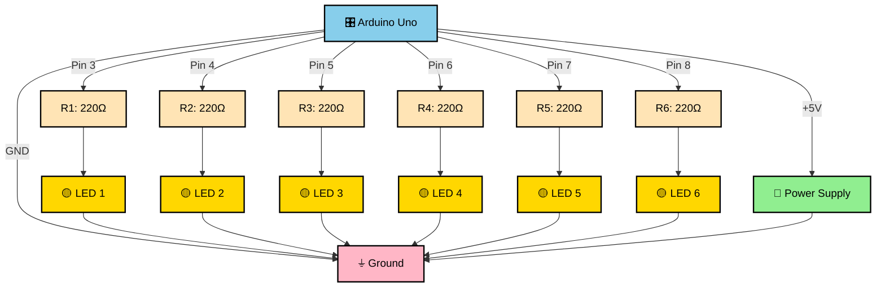

# LED Sequence Circuit - Complete Schematic

## Circuit Diagram (Detailed View)



---

## Pin Connection Table

### Arduino Digital Output Pins
```
┌─────────┬──────────┬─────────────────────┬────────────────┐
│ LED # │ Pin # │ Resistor Value  │ LED Color (Example) │
├─────────┼──────────┼─────────────────────┼────────────────┤
│ LED 1   │ Pin 3    │ 220Ω (1/4W)       │ Red / Yellow    │
│ LED 2   │ Pin 4    │ 220Ω (1/4W)       │ Red / Yellow    │
│ LED 3   │ Pin 5    │ 220Ω (1/4W)       │ Red / Yellow    │
│ LED 4   │ Pin 6    │ 220Ω (1/4W)       │ Red / Yellow    │
│ LED 5   │ Pin 7    │ 220Ω (1/4W)       │ Red / Yellow    │
│ LED 6   │ Pin 8    │ 220Ω (1/4W)       │ Red / Yellow    │
│ GND     │ GND      │ Ground Rail         │ Common Cathode  │
│ +5V     │ 5V       │ Power Rail          │ Power Supply    │
└─────────┴──────────┴─────────────────────┴────────────────┘
```

---

## Breadboard Layout (Top View)

```
                  BREADBOARD (830 Points)
    ┌────────────────────────────────────────────────────┐
    │  +5V                                         GND    │
    │   +  ─  +  ─  +  ─  +  ─  +  ─  +  ─  +  ─  +  ─  │
    │   |  |  |  |  |  |  |  |  |  |  |  |  |  |  |  |  │
Row │   a  b  c  d  e  f  g  h  i  j  k  l  m  n  o  p  │
    │                                                      │
1   │ 5V |──────────────────────────────────────────| GND│
    │    |                                                │
2   │    │   R1  LED1                              R2 LED2
    │    │   ──→  ●                                ──→ ●
3   │    │                                                │
    │    │   R3  LED3                              R4 LED4
    │    │   ──→  ●                                ──→ ●
4   │    │                                                │
    │    │   R5  LED5                              R6 LED6
    │    │   ──→  ●                                ──→ ●
5   │    │                                                │
    │    └──────────────────────────────────────────────┘
    │
    ├─ From Arduino Pin 3 ─→ To R1 anode
    ├─ From Arduino Pin 4 ─→ To R2 anode
    ├─ From Arduino Pin 5 ─→ To R3 anode
    ├─ From Arduino Pin 6 ─→ To R4 anode
    ├─ From Arduino Pin 7 ─→ To R5 anode
    ├─ From Arduino Pin 8 ─→ To R6 anode
    ├─ From Arduino 5V ─→ To positive rail
    └─ From Arduino GND ─→ To negative rail
```

---

## Electrical Specifications

### Power Supply
- **Arduino Voltage**: 5V (from USB)
- **Max Current per Pin**: 40mA (typical Arduino)
- **Total Circuit Current**: ~6 LEDs × 13.6mA = ~82mA
- **Available Current**: USB supplies ~500mA (sufficient)

### LED Specifications
| Parameter | Value | Notes |
|-----------|-------|-------|
| Forward Voltage (Vf) | ~2.0V | Red/Yellow typical |
| Forward Current (If) | 20mA | Maximum safe |
| Resistor Limiting | 220Ω | Yields ~13.6mA |
| Actual Current | 13.6mA | Within safe limits |
| Power Dissipation | ~3W total | Safe for 5V system |

### Resistor Calculation
```
Formula: R = (V_supply - V_led) / I_desired
         R = (5V - 2V) / 20mA
         R = 3V / 0.02A
         R = 150Ω (theoretical minimum)

Selected: 220Ω (next higher standard value)
Actual: I = (5V - 2V) / 220Ω = 13.6mA ✓
```

---

## Wiring Details

### From Arduino to Breadboard

```
Arduino ─ Jumper Wire ─ Breadboard Column ─ Component
───────────────────────────────────────────────────────
Pin 3  ──────────────→ Resistor R1 Anode
Pin 4  ──────────────→ Resistor R2 Anode
Pin 5  ──────────────→ Resistor R3 Anode
Pin 6  ──────────────→ Resistor R4 Anode
Pin 7  ──────────────→ Resistor R5 Anode
Pin 8  ──────────────→ Resistor R6 Anode
+5V    ──────────────→ Positive Rail (+)
GND    ──────────────→ Negative Rail (-)
```

### From Components to Ground

```
LED Cathode (short leg) ─────────→ Negative Rail (GND)
                ↓
          Ground Junction
                ↓
        All LEDs Connected Here
                ↓
          Arduino GND Pin
```

---

## Signal Flow Diagram

### When Pin 3 = HIGH (5V)
```
Arduino Pin 3 (5V)
       ↓
    Resistor R1 (220Ω, voltage drop ~0.6V)
       ↓
    LED 1 Anode (forward voltage drop ~2V)
       ↓
    LED 1 Cathode (now at ~0V)
       ↓
    Arduino GND (0V)

Result: Current flows → LED 1 LIGHTS UP ✓
```

### When Pin 3 = LOW (0V)
```
Arduino Pin 3 (0V)
       ↓
    Resistor R1 (220Ω, no potential difference)
       ↓
    LED 1 Anode (at 0V, same as cathode)
       ↓
    LED 1 Cathode (at 0V)
       ↓
    Arduino GND (0V)

Result: No current → LED 1 OFF ✓
```

---

## Expected Voltage Levels

### When LED ON (Pin = HIGH)
```
Arduino Pin    =  5.0V
Resistor Drop ≈  0.6V (at 13.6mA through 220Ω)
LED Cathode   ≈  0.0V (at GND)
LED Anode     ≈  2.4V (5V - 0.6V - 2V)

Voltage across LED: 2.4V - 0.0V = 2.4V ✓
Current through LED: (5V - 2V) / 220Ω = 13.6mA ✓
```

### When LED OFF (Pin = LOW)
```
Arduino Pin    =  0.0V
Resistor Drop ≈  0.0V (no current)
LED Cathode   ≈  0.0V (at GND)
LED Anode     ≈  0.0V (same as pin)

No voltage difference → No current → LED OFF ✓
```

---

## Safety Considerations

### Current Protection
- ✓ 220Ω resistor limits current to 13.6mA (under 20mA LED rating)
- ✓ Total circuit current ~82mA (under 500mA USB limit)
- ✓ Arduino pin current ~82mA/6 = 13.6mA per pin (under 40mA limit)

### Voltage Protection
- ✓ Arduino outputs are 5V (within specification)
- ✓ No external high-voltage components
- ✓ No polarity reversal possible with correct wiring

### Thermal Management
- ✓ Resistor power: P = I²R = (0.0136A)² × 220Ω = 0.041W
- ✓ Each resistor: 0.041W (well under 0.25W rating)
- ✓ No heat management required

---

## Component Sourcing

### Where to Buy
- **Arduino Uno**: Electronics supplier, online retailer
- **LEDs (6x)**: Electronics supplier, variety pack
- **Resistors 220Ω (6x)**: Electronics supplier, resistor assortment kit
- **Breadboard**: Electronics supplier, prototype kit
- **Jumper Wires**: Electronics supplier, wire pack
- **USB Cable**: Standard Arduino USB type (included with many boards)

### Common Suppliers
- Electronics retailers (Digi-Key, Mouser, etc.)
- Online marketplaces (Amazon, eBay, etc.)
- Local electronics shops
- School/university electronics labs

---

## Modification Guide

### To Add More LEDs
```
Modify Code:
  const int NUM_LEDS = 8;  // Changed from 6
  const int LED_PINS[NUM_LEDS] = {3, 4, 5, 6, 7, 8, 9, 10, 11};

Hardware:
  - Add 2 more 220Ω resistors
  - Add 2 more LEDs
  - Use Arduino pins 9-10 (or 9-11 for more)
  - Connect to breadboard as before
```

### To Adjust Speed
```cpp
// Current: 500ms between LEDs
const int DELAY_TIME = 500;

// Options:
const int DELAY_TIME = 250;  // Twice as fast
const int DELAY_TIME = 1000; // Twice as slow
const int DELAY_TIME = 100;  // Very fast (blink effect)
```

### To Reverse Direction
```cpp
// Original: Light 1,2,3,4,5,6 then turn off
// Modified: Light 1,2,3,4,5,6 then turn off 6,5,4,3,2,1

// Add this function after loop():
void reverseSequence() {
  for (int i = NUM_LEDS - 1; i >= 0; i--) {
    digitalWrite(LED_PINS[i], LOW);
    delay(DELAY_TIME);
  }
}
```

---

## Verification Checklist

- [ ] All wire connections are secure (no loose contacts)
- [ ] LED polarity is correct (long leg = anode = +)
- [ ] All resistors are 220Ω (verify color bands)
- [ ] Arduino has USB power (check LED on board)
- [ ] Code has been uploaded successfully
- [ ] Serial monitor is open at 9600 baud
- [ ] LEDs light up in correct sequence
- [ ] No LED is too bright (would indicate low resistor value)
- [ ] No LED doesn't light at all (check polarity and connections)

---

## Troubleshooting Flowchart

```
LED Not Lighting?
├─ Check LED polarity
│  ├─ Correct? → Check resistor
│  └─ Wrong? → Flip LED, test again
│
├─ Check resistor connection
│  ├─ Correct value? → Check pin number
│  └─ Wrong value? → Replace with 220Ω
│
├─ Check Arduino pin number
│  ├─ Pin 3-8? → Check GND connection
│  └─ Wrong pin? → Rewire to correct pin
│
└─ Check GND connection
   ├─ Connected? → Try different LED
   └─ Not connected? → Connect LED cathode to GND rail
```

---

## Summary

This LED sequence circuit demonstrates:
- **Digital Output Control**: Using Arduino pins to control external components
- **Current Protection**: Resistors limiting LED current to safe levels
- **Circuit Design**: Parallel LED configuration for independent control
- **Programming Logic**: For loops for efficient sequential control
- **Arduino Capabilities**: Multiple simultaneous outputs with precise timing

**All components are standard, readily available, and cost-effective for educational use.**

---

Generated: 2026-04-23  
Course: Robotics 1  
Activity: LED Sequence with For Loop
