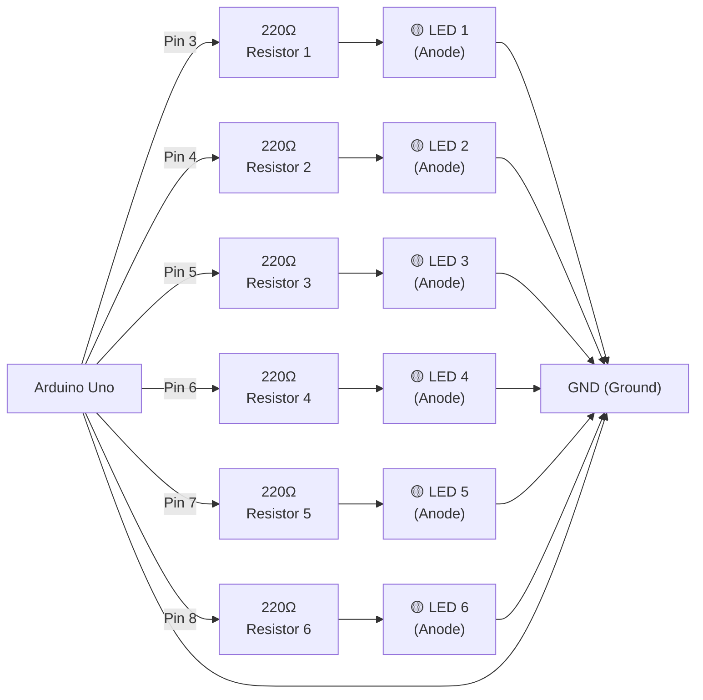

# LED Sequence Circuit Diagram

## Circuit Schematic

## Pin Configuration

| LED Number | Arduino Pin | Resistor | LED Polarity |
|------------|------------|----------|--------------|
| LED 1 | Pin 3 | 220Ω | Anode → Cathode to GND |
| LED 2 | Pin 4 | 220Ω | Anode → Cathode to GND |
| LED 3 | Pin 5 | 220Ω | Anode → Cathode to GND |
| LED 4 | Pin 6 | 220Ω | Anode → Cathode to GND |
| LED 5 | Pin 7 | 220Ω | Anode → Cathode to GND |
| LED 6 | Pin 8 | 220Ω | Anode → Cathode to GND |

## Component List

- **Arduino Uno** (or compatible)
- **6x LED** (any color: Red, Yellow, Green, etc.)
- **6x 220Ω Resistors** (1/4W, 5% tolerance)
- **Jumper Wires**
- **Breadboard** (optional but recommended)
- **USB Cable** for programming and power

## Circuit Description

- Each LED is connected in series with a 220Ω resistor
- The resistor protects the LED and limits current (~15mA per LED)
- All LED cathodes connect to Arduino GND
- Arduino digital pins 3-8 control each LED independently
- When a pin goes HIGH (5V), the LED lights up
- When a pin goes LOW (0V), the LED turns off

## Operation

The code uses a **For Loop** to:
1. **Turn ON** LEDs sequentially (1→2→3→4→5→6) with 500ms delays
2. **Turn OFF** LEDs sequentially (1→2→3→4→5→6) with 500ms delays
3. Pause for 1 second before repeating the cycle

This creates a chasing/running light effect!
