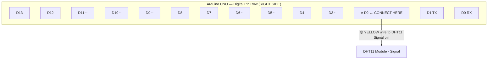
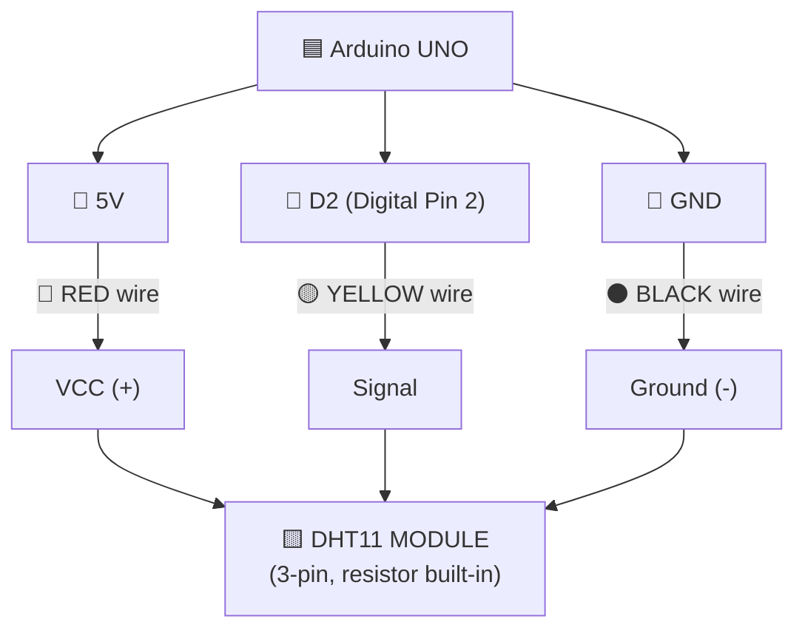
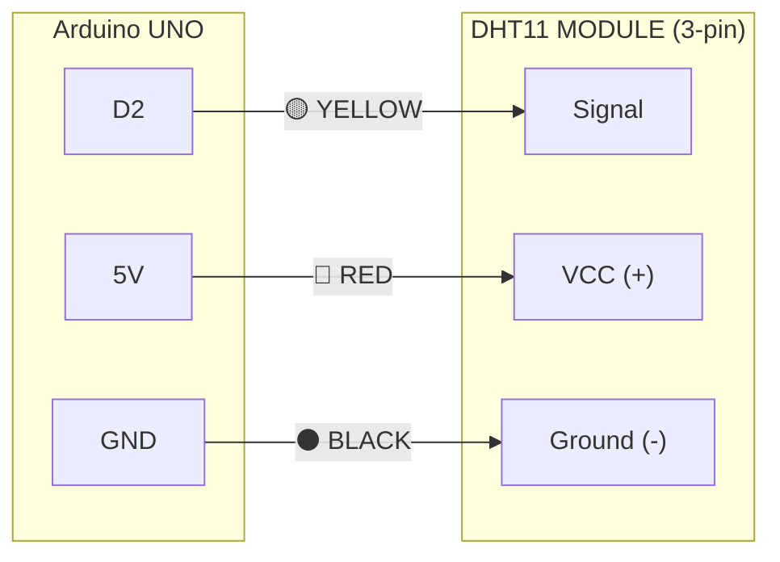
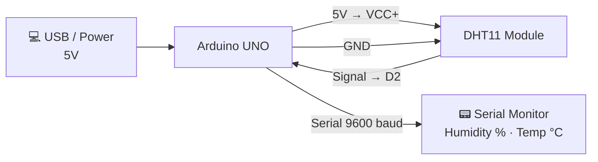
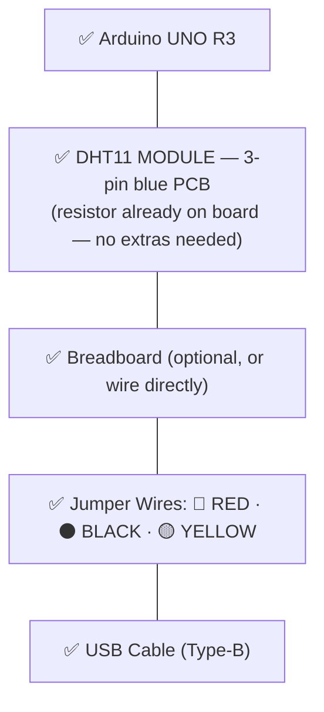
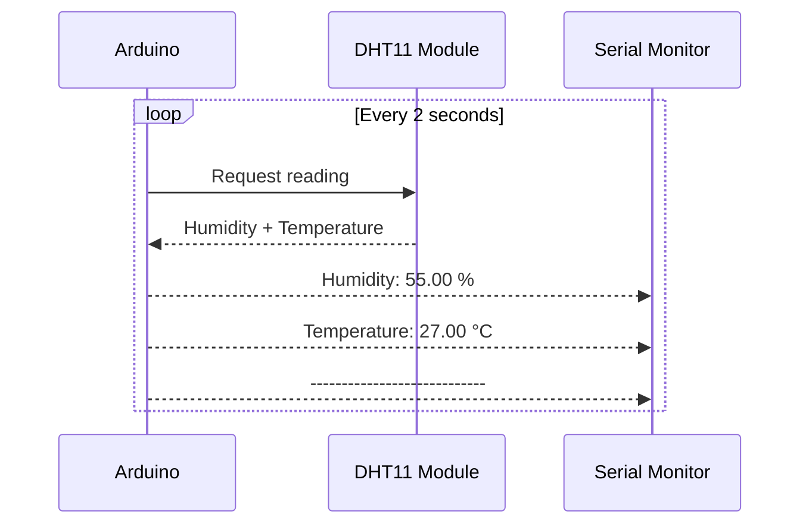

# Arduino DHT11 Humidity Sensor — Circuit Diagram
> Using the **DHT11 MODULE** (blue PCB, 3 pins) — 10kΩ resistor is already built in.

---

## Where is D2 on Arduino UNO?

> **D2 is the 3rd pin from the bottom** of the digital pin row, just above D1 TX and D0 RX.

---

## Wiring Schematic

---

## Pin Reference Table

---

## Power Flow

---

## Component Checklist

---

## Serial Monitor Output (expected)

